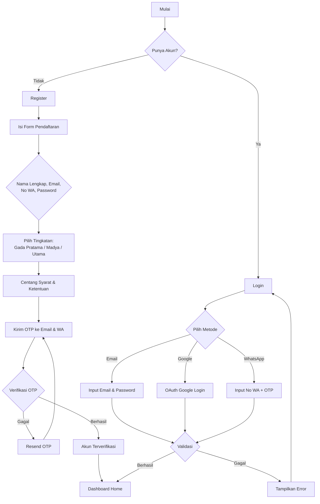
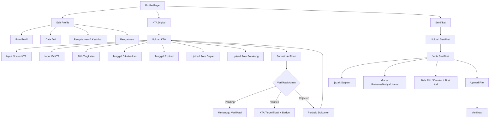
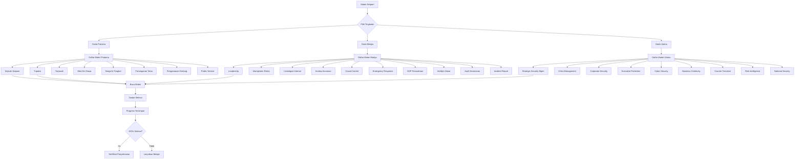
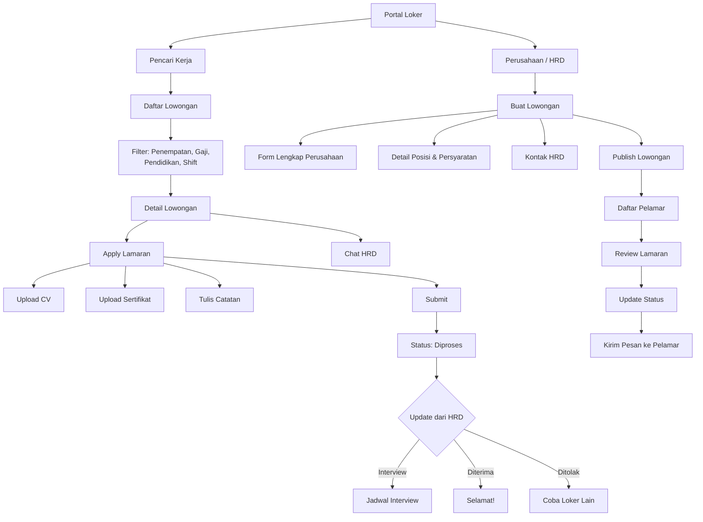
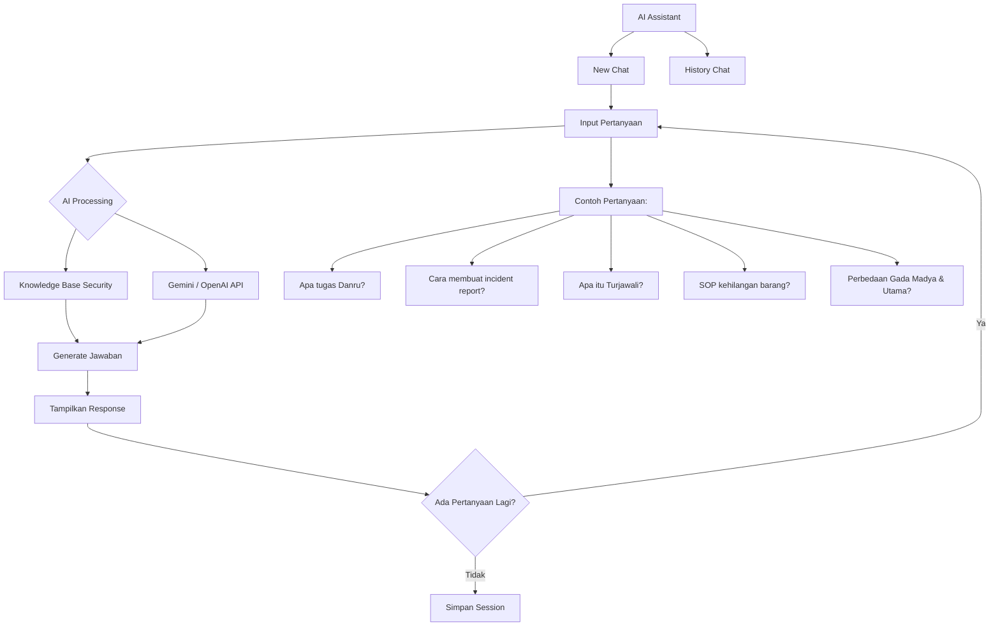
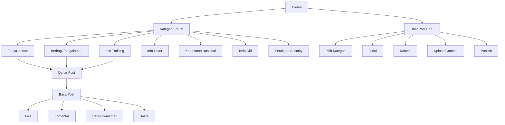
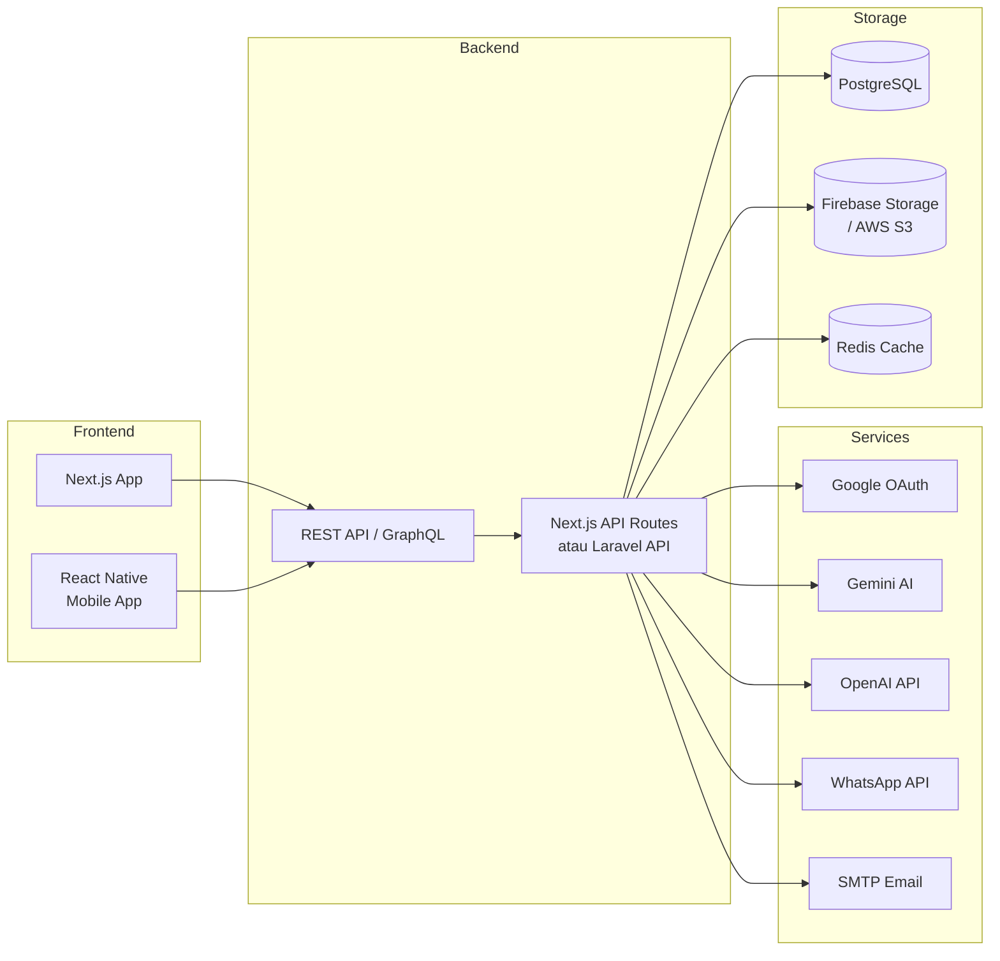
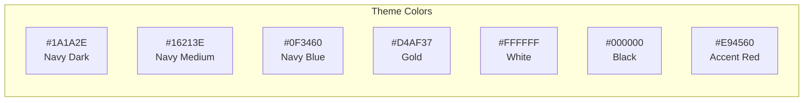

# Flowchart Sistem - SATPAM INDONESIA JAYA

## 1. Authentication Flow



## 2. Profile & Digital KTA Flow



## 3. LMS / Materi Flow



## 4. Portal Loker Flow



## 5. AI Assistant Flow



## 6. Forum Komunitas Flow



## 7. Struktur Navigasi Aplikasi

```mermaid
flowchart TD
    A[Aplikasi SATPAM INDONESIA JAYA] --> B[Home / Dashboard]
    A --> C[Materi Satpam]
    A --> D[Loker]
    A --> E[Forum]
    A --> F[AI Assistant]
    A --> G[Sertifikat]
    A --> H[Profile]
    A --> I[Notifikasi]
    
    B --> B1[Statistik Belajar]
    B --> B2[Materi Terbaru]
    B --> B3[Loker Terbaru]
    B --> B4[Aktivitas Forum]
    B --> B5[Progress Belajar]
    
    C --> C1[Gada Pratama]
    C --> C2[Gada Madya]
    C --> C3[Gada Utama]
    C --> C4[Progress Saya]
    
    D --> D1[Cari Loker]
    D --> D2[Lamaran Saya]
    D --> D3[Pasang Loker - HRD]
    
    E --> E1[Semua Post]
    E --> E2[Kategori]
    E --> E3[Buat Post]
    E --> E4[Post Saya]
    
    H --> H1[Edit Profile]
    H --> H2[KTA Digital]
    H --> H3[Sertifikat]
    H --> H4[Badge]
    H --> H5[Pengaturan]
    
    I --> I1[Notifikasi Baru]
    I --> I2[History Notifikasi]
```



## 8. Arsitektur Sistem



## 9. Struktur Folder Project

```
satpam-indonesia-jaya/
├── frontend/                          # Next.js Web App
│   ├── public/
│   │   ├── images/
│   │   ├── icons/
│   │   └── fonts/
│   ├── src/
│   │   ├── app/                       # App Router
│   │   │   ├── (auth)/
│   │   │   │   ├── login/
│   │   │   │   ├── register/
│   │   │   │   └── forgot-password/
│   │   │   ├── (dashboard)/
│   │   │   │   ├── dashboard/
│   │   │   │   ├── materi/
│   │   │   │   ├── loker/
│   │   │   │   ├── forum/
│   │   │   │   ├── ai-assistant/
│   │   │   │   ├── sertifikat/
│   │   │   │   ├── profile/
│   │   │   │   └── notifications/
│   │   │   ├── landing/
│   │   │   ├── layout.tsx
│   │   │   └── page.tsx
│   │   ├── components/
│   │   │   ├── ui/                    # Reusable UI components
│   │   │   │   ├── Button.tsx
│   │   │   │   ├── Card.tsx
│   │   │   │   ├── Input.tsx
│   │   │   │   ├── Modal.tsx
│   │   │   │   ├── Badge.tsx
│   │   │   │   └── ...
│   │   │   ├── layout/
│   │   │   │   ├── Navbar.tsx
│   │   │   │   ├── Sidebar.tsx
│   │   │   │   ├── Footer.tsx
│   │   │   │   └── MobileNav.tsx
│   │   │   ├── auth/
│   │   │   ├── materi/
│   │   │   ├── loker/
│   │   │   ├── forum/
│   │   │   ├── ai-assistant/
│   │   │   ├── profile/
│   │   │   └── sertifikat/
│   │   ├── lib/
│   │   │   ├── api-client.ts
│   │   │   ├── auth.ts
│   │   │   └── utils.ts
│   │   ├── hooks/
│   │   ├── types/
│   │   ├── store/                     # State management
│   │   └── styles/
│   ├── tailwind.config.ts
│   ├── next.config.js
│   └── package.json
│
├── backend/                           # Laravel API (alternatif)
│   ├── app/
│   │   ├── Http/
│   │   │   ├── Controllers/
│   │   │   │   ├── Api/
│   │   │   │   │   ├── AuthController.php
│   │   │   │   │   ├── ProfileController.php
│   │   │   │   │   ├── MateriController.php
│   │   │   │   │   ├── LokerController.php
│   │   │   │   │   ├── ForumController.php
│   │   │   │   │   ├── AIController.php
│   │   │   │   │   ├── SertifikatController.php
│   │   │   │   │   ├── NotificationController.php
│   │   │   │   │   └── AdminController.php
│   │   │   │   └── Controller.php
│   │   │   ├── Middleware/
│   │   │   ├── Requests/
│   │   │   └── Resources/
│   │   ├── Models/
│   │   ├── Services/
│   │   └── Providers/
│   ├── database/
│   │   ├── migrations/
│   │   └── seeders/
│   ├── routes/
│   │   └── api.php
│   └── composer.json
│
├── database/
│   └── schema.sql                     # Full PostgreSQL schema
│
├── docs/
│   ├── ERD.md
│   ├── FLOWCHART.md
│   ├── API.md
│   ├── ROADMAP.md
│   └── PITCH_DECK.md
│
├── mobile/                            # React Native / Expo
│   ├── app/
│   ├── components/
│   ├── screens/
│   └── package.json
│
└── README.md
```

## 10. Color System


